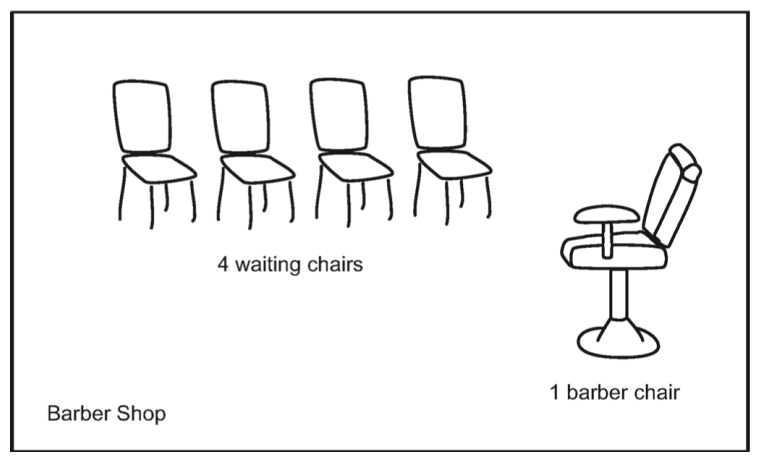

# Overview

The *Sleeping Barber Problem* is attributed to Dijkstra and is based on the following scenario:

> A barbershop contains a barber, the barber's chair, and N chairs for waiting customers. When there are no customers, the barber sits in his chair and sleeps. When a customer arrives:
>
> - If the barber is sleeping, the customer awakens the barber and sits down for a haircut;
> - If the barber is busy and there is a free chair, the customer sits down and waits;
> - If the barber is busy and there are no free chairs, the customer leaves immediately.

More specifically, there are 10 customers and 1 barber, each represented by a thread and a monitor representing the barbershop with two methods, `barber()` and `customer()`.

- The barber thread calls `barber()`, which never returns (i.e., the barber never leaves the shop). The barber sleeps until woken up by a customer, and then gives haircuts (average times 1.2 seconds, exponentially distributed) until there are no customers left, after which he goes to sleep again.
- Each customer thread loops, alternatively sleeping for a period of time (average 10 seconds, exponentially distributed) and then calling `customer()`, which returns after the customer leaves the shop (immediately if all the chairs are full, or after getting a haircut).

### [Part 1 -- Synchronization](part-1.md)

In this part, you will be asked to design a monitor that can be used to solve the barber shop problem

### [Part 2 -- POSIX Threads](part-2.md)

In this part, you will be asked to implement the monitor you designed in Part 1 using POSIX thread primitives.

### [Part 3 -- Discrete-Event Simultation](part-3.md)

In this part, you will be asked to collect statistics about your implementation from Part 2 by building it a framework for discrete-event simulation.  This means that your code will run in simulated time allowing for much faster results.

CS5600 Project Rules
================

I expect you to work in teams of two students; you will submit one copy of the homework and receive the same grade. Feel free to discuss the ideas in the homework with other groups, but absolutely no sharing of code across groups is allowed. All your code should come from your own fingers typing on the keyboard - if you're copy-and-pasting it from somewhere (from another team or from the Internet) it's likely to be academic dishonesty.

Submitting your work
------------------

You do not need to explicitly submit your assignment --- your grade will be based on the code in your repository at the time it is due.

Commit and push your work frequently
---------------------------------

Commit your changes frequently ­ at least once every two days while you are working on the project, and preferably much more often. These check-ins serve to document that you and your teammate wrote the code you are submitting, rather than copying it from someone else. Failure to check in frequently will result in a lower grade.

Progress report
-------------

You will be required to submit a progress report partway through the assignment ­ this is a text file in your repository (named progress.txt) describing the work you have done so far and your plans for finishing the project. It can include things like "discussed design of part X", or "implemented Y function", etc.  Remember to use `git add`, `git commit`, and `git push` so I can see your report.  It's a good idea to create this file at the very beginning and use it to make notes on the work you've done.

Testing
------

You are expected to implement tests for your code and to check them in as part of the assignment. (As a general rule, code that hasn't been tested doesn't work. Therefore if you didn't test your code but it passes my tests, then it's a lucky accident and doesn't deserve as good a grade as if you actually tested it and know it works)  Run your tests under Valgrind, as well - it will catch a lot of bugs before they actually happen.

Code Quality
-----------

Unlike most workplaces or open-source projects, the coding standards for this class are minimal. They are:

1. Initialize every variable when you declare it.
2. Get rid of all compiler warnings. There's almost always a good reason the compiler is complaining - fix it. 
3. Indent your code consistently and reasonably.
4. Use reasonable variable and function names. If you change what a function does, **change the name of the function to reflect that**.
5. Comments are for comments, not for code. Your editor has a perfectly good "delete line" function, and Git can keep track of things that you deleted.

Other than #1 and #2, these can all be described as **Don't write ugly code**. Take some pride in your work; don't turn in something that makes you look bad.

Grading
------

Things you can lose points for:

- Failure to achieve any progress by the progress report date, or failure to commit your code frequently.
- Really ugly code, compiler warnings, uninitialized variables
- Failure to implement all of the requested functionality. 
- Test failures (on the grading tests) 
- Not enough testing.